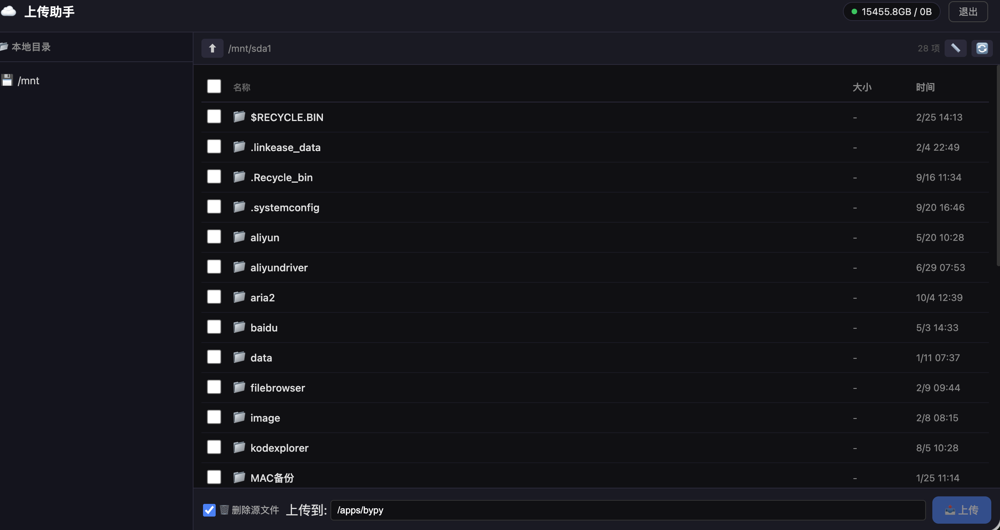

# ☁️ 百度网盘上传助手

> Web-based Baidu Netdisk upload tool — 带 Web 界面的百度网盘上传工具

[](LICENSE)

---

## 📸 界面预览



---

## ✨ 功能

### 📂 文件浏览
- 浏览本地文件系统，支持多硬盘挂载点
- 显示文件大小、修改时间
- 可选显示文件夹大小（📏 一键开关）
- 已同步的文件显示 ✅ 绿色标记

### 📤 上传到百度网盘
- **单个文件上传** — 勾选即传
- **目录递归上传** — 选中目录自动遍历所有子文件，后台异步扫描不卡界面
- **实时进度** — 文件级和目录级百分比进度条

### 🗑️ 上传后管理
- **自动删除源文件** — 上传完成可选删除本地文件
- **权限自动处理** — exFAT/NTFS 等无权限文件系统自动用 Docker fallback 删除

### 🔄 可靠性
- **崩溃恢复** — 服务重启后自动恢复未完成的上传
- **并发控制** — 最多 5 个文件同时上传，不撑爆内存
- **上传队列** — 清晰展示排队/上传中/完成/失败状态

### 📱 响应式设计
- 手机端自适应布局
- 侧边栏滑出菜单
- 触控友好的操作区域

---

## 🚀 快速开始

### 环境要求

- Python 3.8+
- pip
- （可选）Docker — 用于删除权限不足的文件

### 安装

```bash
# 1. 克隆
git clone https://github.com/wvqkhn/baidu-uploader.git
cd baidu-uploader

# 2. 安装依赖
pip install -r requirements.txt
```

### 配置

通过环境变量配置（无需修改代码）：

```bash
# Web 登录密码
export APP_PASSWORD="your-password"

# 监听端口
export APP_PORT=3456

# 允许浏览的目录（逗号分隔）
export BASE_DIRS="/mnt,/home"

# 可选：Flask 密钥
export SECRET_KEY="random-secret-key"
```

或直接编辑 `config.py`。

### 获取百度网盘授权

```bash
# 安装 bypy
pip install bypy

# 首次授权
bypy info

# → 打开显示的 URL，登录百度账号
# → 授权后粘贴 Authorization Code
```

### 启动

```bash
python3 app.py
```

浏览器打开 **http://your-ip:3456** 即可访问。

---

## ⚙️ 配置项

| 环境变量 | 说明 | 默认值 |
|---------|------|--------|
| `APP_PORT` | 监听端口 | `3456` |
| `APP_PASSWORD` | Web 登录密码 | `admin123` |
| `SECRET_KEY` | Flask session 密钥 | `change-this` |
| `BAIDU_TOKEN_FILE` | 百度 Token 文件路径 | `~/.bypy/bypy.json` |
| `BASE_DIRS` | 允许浏览的根目录（逗号分隔） | `/mnt` |
| `DOCKER_RM_IMAGE` | 删除操作用 Docker 镜像 | `busybox:latest` |
| `DB_PATH` | 数据库路径 | `./uploads.db` |

---

## 📡 API 接口

Web 界面底层使用 RESTful API，可用于脚本化操作：

| 方法 | 路径 | 说明 |
|------|------|------|
| `GET` | `/api/list?path=/mnt` | 列出目录内容 |
| `GET` | `/api/baidu/status` | 百度网盘使用情况 |
| `POST` | `/api/upload/start` | 开始上传文件/目录 |
| `GET` | `/api/upload/queue` | 获取上传队列状态 |
| `POST` | `/api/delete-synced` | 删除已同步的源文件 |
| `GET` | `/api/synced` | 获取已同步文件列表 |

---

## 🏗️ 技术架构

```
┌─────────────┐     ┌──────────────┐     ┌─────────────┐
│  浏览器     │────▶│  Flask Web   │────▶│  百度 PCS   │
│  HTML/JS    │     │  Python      │     │  API        │
└─────────────┘     └──────┬───────┘     └─────────────┘
                           │
                    ┌──────▼───────┐
                    │  SQLite DB   │
                    │  (上传记录)   │
                    └──────────────┘
```

### 核心依赖

- **后端**: Python Flask + SQLite
- **前端**: 原生 HTML/CSS/JS（无前端框架依赖）
- **上传**: Baidu PCS API + `requests-toolbelt`（实时进度追踪）
- **并发控制**: `threading.Semaphore(5)` — 限制 5 并发上传
- **文件大小计算**: `du` 命令（带缓存和超时）

---

## 📁 项目结构

```
baidu-uploader/
├── app.py                 # Flask Web 应用主程序
├── config.py              # 配置文件（支持环境变量）
├── requirements.txt       # Python 依赖
├── .gitignore
├── README.md
├── scripts/
│   └── baidu_upload.py    # 百度网盘 CLI 上传脚本
└── templates/
    ├── index.html         # 主界面（文件浏览 + 上传）
    └── login.html         # 登录页面
```

---

## 🤝 贡献

欢迎 Issue 和 PR！

1. Fork 本仓库
2. 创建功能分支 (`git checkout -b feature/amazing`)
3. 提交更改 (`git commit -m 'Add something amazing'`)
4. 推送到分支 (`git push origin feature/amazing`)
5. 提交 Pull Request

---

## 📄 License

[MIT](LICENSE)

---

*Made with ❤️ for the open source community*
